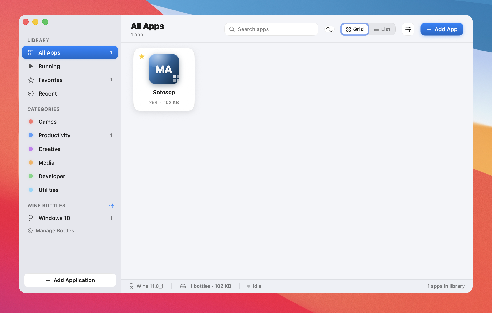

# MacWine

A native macOS app for running Windows applications on your Mac, powered by [Wine](https://www.winehq.org). Add a Windows `.exe` by drag-and-drop, double-click to run, and manage everything from a clean SwiftUI library — no terminal required.



## Install

1. Download **MacWine.dmg** from the [latest release](https://github.com/moerdowo/MacWine/releases/latest).
2. Open the DMG and drag **MacWine** into your **Applications** folder.

### Opening a non-notarized app

MacWine is **not notarized by Apple**, so Gatekeeper blocks it on first launch. This is expected — pick one of these (one-time):

- **Right-click to open:** in Applications, Control-click (right-click) **MacWine** → **Open** → **Open**.
- **If macOS still blocks it** (Sequoia/Tahoe): open **System Settings → Privacy & Security**, scroll to the *"MacWine was blocked"* message, click **Open Anyway**, then launch it again.
- **Or via Terminal** — remove the quarantine flag, then open normally:
  ```bash
  xattr -dr com.apple.quarantine /Applications/MacWine.app
  ```

After the first successful launch, MacWine opens normally like any other app. (Prefer to skip all this? Build it yourself — see [Build & run](#build--run) — locally built apps aren't quarantined.)

## Features

- **App library** — add Windows apps by dragging a `.exe`/folder anywhere into the window, the **Add App** button, or by scanning a bottle's Program Files. Double-click to run.
- **Bundled, self-updating Wine** — on first launch MacWine downloads the latest **stable** Wine build into its support folder and checks for newer builds on every open. Choose the stable / staging / devel channel in Tweaks. No separate Wine install needed.
- **Wine bottles** — create, rename, and delete isolated prefixes; pick the Windows version (7/10/11) and architecture (32/64-bit); run `winecfg`, `regedit`, the Control Panel, open the C: drive, initialize/repair, or reset.
- **winetricks** — one-click install of common runtime components (DXVK, VKD3D, Visual C++ runtimes, .NET, core fonts, …).
- **Per-app launch options** — arguments, working directory, environment variables, `WINEDEBUG`, esync, Retina/HiDPI, and a virtual desktop size.
- **Custom & extracted icons** — pick your own image, or let MacWine pull the real icon straight out of the `.exe` (it also auto-detects x86/x64).
- **Add to Applications** — export a standalone double-clickable launcher to `~/Applications`.
- **Quality of life** — favorites, categories, search, grid/list views, sorting, live launch console with log saving, accurate running state, uninstall with undo, light/dark themes, and notifications.

## Requirements

- macOS 26 (Tahoe) or later
- Apple Silicon or Intel Mac

## Build & run

MacWine is a Swift Package. To build a double-clickable app:

```bash
git clone https://github.com/moerdowo/MacWine.git
cd MacWine
./bundle.sh          # builds MacWine.app
open MacWine.app
```

Or run directly during development:

```bash
swift run
```

## How it works

MacWine keeps everything under `~/Library/Application Support/MacWine`:

- `Wine/` — the managed Wine runtime (`installed.json` records the version/channel)
- `Bottles/<id>/` — each bottle's `WINEPREFIX`
- `Icons/`, `Logs/`, `library.json` — app icons, launch logs, and the library

Apps run as a normal `wine` process inside their bottle's prefix; MacWine watches `wineserver` to track when the real window actually closes.

## Licensing & acknowledgements

MacWine runs apps using **Wine**, which is licensed under the **GNU LGPL v2.1 or later**. The full license texts, attributions, and source-code offer ship with the app (Tweaks → About → *Licenses & acknowledgements*) and live in [`licenses/`](licenses/).

- **Wine** — © the Wine project authors, LGPL-2.1-or-later — https://gitlab.winehq.org/wine/wine
- **Wine macOS builds** — [Gcenx/macOS_Wine_builds](https://github.com/Gcenx/macOS_Wine_builds)
- **winetricks** — LGPL-2.1 — https://github.com/Winetricks/winetricks

MacWine does **not** bundle or redistribute Microsoft components. winetricks downloads any Microsoft redistributables on demand, on your machine, under their own license terms.

> "Wine" is a trademark of the Wine project. MacWine is an independent project and is not affiliated with or endorsed by the Wine project or CodeWeavers.
